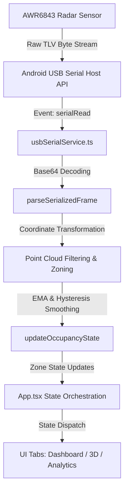

# CabinIQ Mobile 🚗📡

**CabinIQ Mobile** is a production-grade, state-of-the-art **In-Cabin Radar Intelligence Platform** designed to monitor vehicle occupancy, detect unattended children (Child Left Behind), and track vitals (heart rate and breathing rate) in real time. 

By interfacing directly with mmWave radar hardware (e.g., Texas Instruments AWR6843 family) via USB OTG Serial or WebSocket transport, CabinIQ Mobile visualizes raw 3D point clouds, computes spatial zone occupancy, and runs local DSP data reduction filters.

---

## ✨ Key Features

- **Real-Time Occupancy Detection:** Pinpoints occupants in specific zones (e.g., Driver, Front Passenger, Rear Seats) and classifies them as adult, child, or empty.
- **Child Left Behind (CLB) Warning:** Automatically flags safety critical alarms if a child is left unattended inside the vehicle cabin.
- **Vital Signs Monitoring:** Decodes micro-doppler radar signatures to display respiration rates and cardiac rates.
- **3D Interactive Point Cloud:** Uses WebGL to render raw spatial reflection points, colored by SNR quality and clustered by zone boundaries.
- **Signal-to-Noise (SNR) & FPS Analytics:** Renders historical sparklines and stats to monitor radar hardware data health.
- **Dual Connection Architecture:** Native USB OTG Serial communications on Android, or WebSocket Network streams for bench-testing and remote setups.
- **Built-in Simulation Subsystem:** Interactive simulation suite containing predefined scenario flows (Driver Solo, Family, Unattended Child) to validate algorithms without hardware.

---

## 🛠️ Technical Stack

- **Frontend Core:** [React 19](https://react.dev/) + [TypeScript](https://www.typescriptlang.org/)
- **Build Server:** [Vite](https://vitejs.dev/)
- **Styles & Layout:** [Tailwind CSS v4](https://tailwindcss.com/)
- **Micro-Animations:** [Motion](https://motion.dev/)
- **Icon Assets:** [Lucide React](https://lucide.dev/)
- **Mobile Runtime:** [Capacitor Core](https://capacitorjs.com/) (using custom Android `@adeunis/capacitor-serial` wrapper for USB host APIs)

---

## 📐 System Architecture & Data Flow

CabinIQ uses a unidirectional, low-latency pipeline to ingest, process, reduce, and render radar outputs:



### 1. Hardware Interface Layer ([usbSerialService.ts](file:///c:/Users/10a32/Downloads/cabiniq-mobile/src/utils/usbSerialService.ts))
Connects to native Capacitor serial events. Converts base64 packets into raw array buffers. Implements a circular byte accumulator to buffer fragmented serial packets and slice them cleanly at frame magic headers (`0x02 0x01 0x04 0x03 0x06 0x05 0x08 0x07`).

### 2. Radar Processing Pipeline ([radarPipeline.ts](file:///c:/Users/10a32/Downloads/cabiniq-mobile/src/utils/radarPipeline.ts))
Parses TI mmWave TLV (Type-Length-Value) records including **Point Cloud (Type 6)** and **Vital Signs (Type 12)**. Negates coordinates based on `sensorPosition` tilt angles (e.g., 90° overhead mounts where the local Z-axis points down).

### 3. Spatial Occupancy State Machine ([radarPipeline.ts](file:///c:/Users/10a32/Downloads/cabiniq-mobile/src/utils/radarPipeline.ts))
Filters coordinates against geometric cuboid zone limits (`cuboidDef`). Computes statistical features (Centroid, Spread, Velocity, SNR) and applies **Exponential Moving Average (EMA)** smoothing, hysteresis windows, and threshold gates to classify occupants.

---

## 📂 Project Structure

```text
cabiniq-mobile/
├── android/                   # Capacitor Native Android Project IDE Workspace
│   └── app/build.gradle       # Android build configs & app permissions
├── patches/                   # Native patches for multi-port serial drivers
├── src/
│   ├── assets/                # App icons, splash assets & AWR6843 chirp cfg profiles
│   ├── components/            # UI Layout and Presentation Tabs
│   │   ├── AndroidFrame.tsx   # Simulated mobile viewport wrapping the web UI
│   │   ├── DashboardTab.tsx   # Seating layout, occupation markers, and vital monitors
│   │   ├── Radar3DTab.tsx     # WebGL 3D point cloud visualization space
│   │   ├── AnalyticsTab.tsx   # Metrics graphing, data stream history, system logs
│   │   ├── SettingsTab.tsx    # Connection configuration, tuning sliders, and test profiles
│   │   └── TerminalTab.tsx    # Raw hexadecimal packet log streams
│   ├── utils/                 # Low-level Services & Data Pipelines
│   │   ├── radarPipeline.ts   # Binary parser, math models, and EMA logic
│   │   ├── usbSerialService.ts# USB OTG Serial link & packet reassembler
│   │   ├── networkService.ts  # WS stream connection with exponential reconnects
│   │   └── radarConfigs.ts    # Bundled radar configurations & profile loader
│   ├── App.tsx                # Central state orchestrator and UI coordinator
│   ├── types.ts               # Core TypeScript definitions and model schemas
│   └── main.tsx               # React application entry point
├── package.json               # Package configurations, versions, and commands
└── vite.config.ts             # Vite server & bundler configuration
```

---

## 🚀 Getting Started & How to Run

### Prerequisites
- **Node.js:** v18.x or higher
- **npm:** v10.x or higher
- **Android SDK:** command-line tools & Android Studio (for compilation to hardware device)

### Installation
1. Clone or navigate to the workspace directory:
   ```bash
   cd cabiniq-mobile
   ```
2. Install dependencies (applies native node_module overrides automatically):
   ```bash
   npm install
   ```

### Running Locally (Vite Dev Server)
1. Boot up the local Web application:
   ```bash
   npm run dev
   ```
2. The server runs at `http://localhost:3000`. Open this address in your web browser. 
3. *Note: Browser sessions operate inside the built-in **Simulation Mode** since direct USB OTG drivers require the native Android platform.*

---

## 📱 Compiling & Deploying to Android (Capacitor)

To compile the application and install it on an Android device to test with real TI mmWave sensors:

### 1. Build Web Assets
Compile the React code and output optimized client assets:
   ```bash
   npm run build
   ```

### 2. Synchronize Code with Native Android Studio
Sync the built output directory (`dist`) with the Gradle project structure:
   ```bash
   npx cap sync android
   ```

### 3. Build & Run from Android Studio
1. Open the Android project in Android Studio:
   ```bash
   npx cap open android
   ```
2. Connect your Android phone to your computer via USB (ensure **USB Debugging** is enabled in developer settings).
3. Tap the **Run (Play)** button in Android Studio to compile the APK and deploy it directly to your phone.

---

## 🛠️ Calibration & Custom Configurations

To maximize detection accuracy:
1. Navigate to **Settings** and ensure Simulation Mode is switched off.
2. Select your sensor configuration profile (e.g., `Nexon EV (2-Row, AOP)` or `VOD - ODS Overhead 2-Row`) from the **Chirp Config File** selector. The config is pushed automatically down the config UART on connect.
3. Keep the vehicle empty and click **Calibrate Baseline** on the Dashboard. This samples ambient SNR and point densities for 5 seconds to establish static noise cancellation filters.
